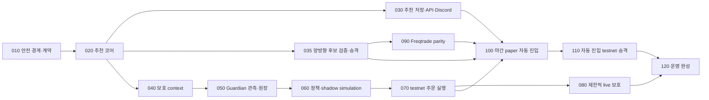

# LUNA 실행용 트레이딩 봇 완성 로드맵

## Loop spec

- **Loop archetype:** dependency-ordered capability delivery
- **Trigger:** Astra 단계에서 정리한 추천·수동 포지션 보호·제한적 자동 진입 구상을 LUNA가 한 작업씩 구현할 수 있는 크기로 분해한다.
- **Goal:** 현재 alert-first 저장소를 유지하면서 추천 품질을 먼저 완성하고, 별도 Position Guardian으로 수동 포지션을 보호한 뒤, 독립 계정의 초소액 자동 진입을 paper/testnet 순서로 검증한다.
- **Non-goals:** 현재 스캐너에 private API나 주문 코드를 넣지 않는다. Phase-S 결과를 미리 열람하지 않는다. 검증되지 않은 FreqAI 결과를 승격하지 않는다. 자동 물타기·마틴게일·무제한 레버리지를 만들지 않는다.
- **Verifier:** 각 작업 문서의 focused tests와 저장소 표준 검증. 주문 관련 단계는 recorded fixture, fault injection, Binance testnet 영수증을 추가한다.
- **Stop condition:** `120_operations_and_completion.md`의 완료 행렬이 모두 충족되거나, 해당 단계의 fail-closed 산출물이 구체적인 외부 blocker를 증명한다.
- **Memory artifact:** 이 디렉터리의 `000_plan.md`와 `010`~`120` 문서. 각 LUNA 작업은 `receipts/<task-id>.md`에 완료 커밋과 검증 결과를 기록한다.
- **Expected outcomes:** 추천 API/Discord, restart-safe Guardian shadow, testnet 보호 주문, 제한적 live protection 승인 패키지, Freqtrade parity/dry-run, 야간 초소액 testnet 자동 진입 승인 패키지.
- **Escalation:** 계좌 모드·주문 명세·최소 주문 조건이 공식 문서와 fixture에서 일치하지 않거나, 주문 timeout 뒤 실제 접수 여부를 증명할 수 없으면 쓰기 동작을 중지하고 관측·알림만 유지한다.

## 현재 기준선

- 기준 브랜치: `codex/public-prospective-ops-20260917`
- 계획 작성 시 기준 커밋: `4ff7759`
- 원격: `https://github.com/HanGuWon/binance-crypto-scanning-bot.git`
- 현행 scanner는 공개 Binance 데이터만 사용하고 주문을 배치하지 않는다.
- `src/signalbot/signals/positions.py`의 `TechnicalExitEngine`과 `calculate_trailing_stop_candidate()`가 paper exit와 ATR trail의 현재 권위다.
- `src/signalbot/signals/position_management.py`에는 deterministic `StopUpdateIntent`를 만드는 순수 `ProtectiveStopPlanner`가 있다.
- live decision은 이미 reasons, invalidation, rule version, deterministic event ID를 가진다.
- PAPER lifecycle은 재시작 복구용 실계좌 원장이 아니다. 그대로 private API를 붙이면 안 된다.
- Freqtrade는 candle-family 비교용 sidecar다. scanner와 EMA 초기화, intrabar flow, 실행 증거가 완전 동일하지 않다.

각 LUNA 작업은 시작 전에 이 기준선을 다시 확인한다. 이후 커밋이 생겼다면 HEAD를 새 기준으로 기록하되, 위 사실이 달라졌는지 먼저 판정한다.

## 선택한 구조

```text
public Binance data
        |
        v
signalbot scanner ----> canonical recommendation ----> Discord / read-only API
        |
        +-------------> closed-candle protection context
                              |
                              v
                    Position Guardian service
                    private read + stop-only write
                              |
                              v
                      selected manual positions

canonical research export ----> Freqtrade sidecar
                                backtest -> dry-run -> testnet
                                dedicated account/subaccount only
```

### Architecture decision record

**Context.** 사용자는 추세 추천, 수동 포지션의 이익 보호, 한국 밤·새벽의 초소액 자동 진입을 원한다. 현재 scanner는 공개 데이터 전용이며 재접속·중복 방지·인과성 계약이 강하다.

**Chosen move.** scanner는 추천과 공개 protection context만 발행한다. `position_guardian`은 별도 Python package/entry point/DB/config로 만들고, 사용자가 선택한 수동 USD-M 포지션의 read/reconcile/stop-only write만 맡긴다. Freqtrade는 historical comparison과 자동 진입 dry-run/testnet에만 사용한다. Guardian은 Freqtrade가 맡지 않는다.

**Rejected alternatives.** scanner 내부에 signed REST와 주문 코드를 넣는 안은 공개 데이터 경계와 장애 격리를 깨므로 제외한다. Freqtrade가 기존 수동 포지션을 인수하게 하는 안은 외부 수동 변경과 계좌 단독 소유 가정이 충돌하므로 제외한다. 추천 점수를 성공 확률로 표시하는 안은 calibration 근거가 없으므로 제외한다.

**Consequences.** 프로세스와 운영 설정이 늘어나지만 credential 격리, 독립 kill switch, 명확한 승격, account ownership이 가능해진다. Guardian은 scanner가 멈추면 마지막으로 확인된 보호 주문을 유지하고 새 갱신을 중단해야 한다.

## 의존성 지도



`020`을 먼저 마친 뒤 `030`, `035`, `040`을 병행할 수 있다. 따라서 canonical 추천 계약은 Guardian보다 먼저 고정되지만, 추천 delivery 전체가 끝날 때까지 Guardian 연구를 막지는 않는다. `030`은 현재 전략 범위를 먼저 전달할 수 있지만, 실제 Futures 양방향 후보는 `035`의 승격 전까지 지원된다고 표시하지 않는다. `090`은 candidate preregistration과 version receipt가 고정된 뒤 진행한다. `100`은 Guardian testnet qualification과 directional promotion을 모두 통과한 뒤 시작한다. `080`의 실제 live 주문 구현 시작과 `110` 이후 production 자동 진입은 각각 별도의 사용자 명시 승인이 필요하다.

## 작업 문서

| 순서 | 문서 | 결과 |
|---:|---|---|
| 10 | `010_safety_architecture.md` | 서비스 경계, capability matrix, 설정 fail-closed 계약 |
| 20 | `020_recommendation_core.md` | LONG/SHORT/NO_ENTRY canonical recommendation |
| 30 | `030_recommendation_delivery.md` | persistence, API, Discord, 운영 지표 |
| 35 | `035_directional_candidate_promotion.md` | 실제 Futures LONG/SHORT 후보의 연구·전향검증·승격 |
| 40 | `040_protection_context.md` | 닫힌 봉 기반 Guardian 입력 계약 |
| 50 | `050_guardian_observer_ledger.md` | 수동 포지션 opt-in, read-only sync, restart-safe ledger |
| 60 | `060_guardian_policy_shadow.md` | trailing policy 비교와 주문 없는 shadow intent |
| 70 | `070_guardian_testnet_execution.md` | idempotent stop-only testnet executor |
| 80 | `080_guardian_limited_live.md` | 지정 포지션에 한정한 live 보호 승인 패키지 |
| 90 | `090_freqtrade_parity.md` | BOT-2/Freqtrade 차이 측정과 dry-run 승격 |
| 100 | `100_overnight_auto_entry_paper.md` | KST 운영 창과 risk-budgeted paper entry |
| 110 | `110_auto_entry_testnet_release.md` | 전용 계정 testnet, production 전 최종 문턱 |
| 120 | `120_operations_and_completion.md` | 배포·장애·복구·완료 행렬 |

## 첫 실행 큐

가장 먼저 `L10-01 -> L10-02 -> L10-03 -> L20-01 -> L20-02 -> L20-03` 순서로 진행한다. 그 뒤 세 lane으로 나눈다.

- 추천 lane: `L20-04 -> L30-01`부터 `L30-05`까지
- 검증된 양방향 후보 lane: `L35-01`부터 순서대로 진행하되 연구 authority gate가 닫혀 있으면 기다린다.
- Guardian lane: recommendation core phase gate 뒤 `L40-01`부터 시작한다. `L60-08`까지 추천 delivery와 병행할 수 있다.

Freqtrade lane은 `L35-02`의 exact candidate version receipt 뒤 시작한다. `L100`은 L35-09까지 끝난 full directional phase gate, L60-08 policy-selection receipt, L70 Guardian testnet qualification receipt, L90-07 parity receipt를 모두 입력으로 받으며 candidate/config hash가 서로 정확히 같아야 한다. `L80`, `L110`은 앞 단계의 실제 receipt를 입력으로 받는다.

## LUNA 공통 실행 계약

한 번의 LUNA 실행은 문서에 적힌 `Lxx-yy` 하나만 맡는다. 인접 작업을 미리 구현하지 않는다.

1. `git status --short --branch`, `git log -1 --oneline`을 기록한다.
2. 해당 작업의 **읽을 파일**, **허용 변경**, **금지 변경**만 따른다.
3. 새 규칙에는 positive, negative, boundary test를 넣는다. 네트워크 unit test는 recorded fixture를 사용한다.
4. focused test를 먼저 통과시킨다. 작업이 code를 바꾸면 마지막에 Ruff, Pyright, pytest, compileall을 실행한다.
5. 같은 event/intent를 두 번 처리하는 재실행 test와 stale/gap/restart 경로를 반드시 확인한다.
6. 완료 보고에는 변경 파일, 결정, 실행 명령/exit code, 남은 위험, 다음 작업의 입력을 쓰고 `receipts/<task-id>.md`에 같은 내용을 남긴다.
7. 한 작업에서 production credential, 원격 배포, live 주문, threshold 변경을 임의로 수행하지 않는다.

계획 문서는 review 후 immutable하게 취급한다. 구현 중 계획 변경이 필요하면 기존 문장을 덮어쓰지 말고 `amendments/<timestamp>-<task-id>.md`에 근거, 영향받는 task, 새 acceptance criteria를 기록한다.

### LUNA에 넘길 공통 프롬프트

```text
현재 저장소의 devlog/_plan/260917_luna-trading-bot-roadmap/<phase-doc>에서
Task <Lxx-yy> 하나만 구현해라. 000_plan.md의 공통 실행 계약과 AGENTS.md를 먼저 읽어라.
선행 조건을 git과 테스트로 확인하고, 허용 변경 경계 밖 파일은 수정하지 마라.
실패 분기가 활성화되면 우회하지 말고 fail-closed 산출물과 재현 명령을 남겨라.
focused 검증과 문서에 적힌 최종 검증을 실행한 뒤, 커밋은 하나로 만들되 push하지 마라.
완료 보고는 변경 파일, 핵심 결정, 검증 결과, 미해결 위험, 다음 task 입력 순서로 작성해라.
```

## 전체 승격 원칙

- 추천 승격과 주문 승격을 묶지 않는다. 추천이 유용해도 주문 권한은 자동으로 생기지 않는다.
- Guardian 승격과 auto-entry 승격을 묶지 않는다. stop-only 보호가 안정적이어도 신규 진입 권한은 생기지 않는다.
- 시간대는 운영 gate다. “밤이라 오른다”를 독립 alpha로 쓰지 않는다.
- score는 rule evidence strength다. calibration 결과 없이 확률 기호를 붙이지 않는다.
- testnet 성공은 production 기대수익 근거가 아니다. 주문 정합성과 장애 처리만 증명한다.
- minimum notional 때문에 risk budget을 넘으면 주문을 건너뛴다.
- 계좌 상태가 불명확하면 새 진입과 stop 갱신을 중단한다. 이미 확인된 보호 주문을 무턱대고 취소하지 않는다.
