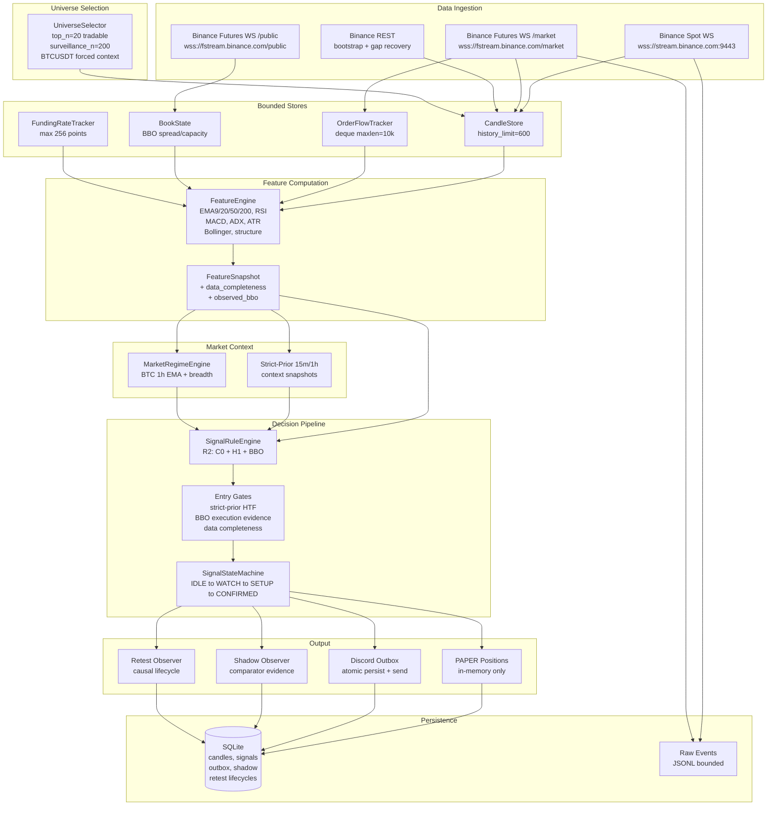
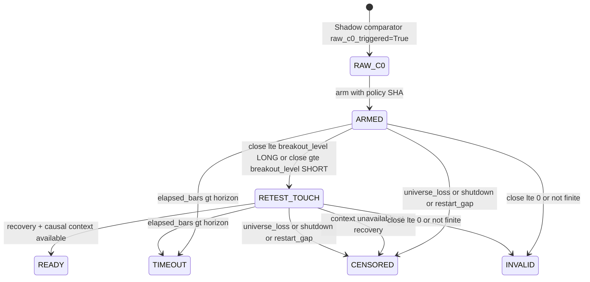
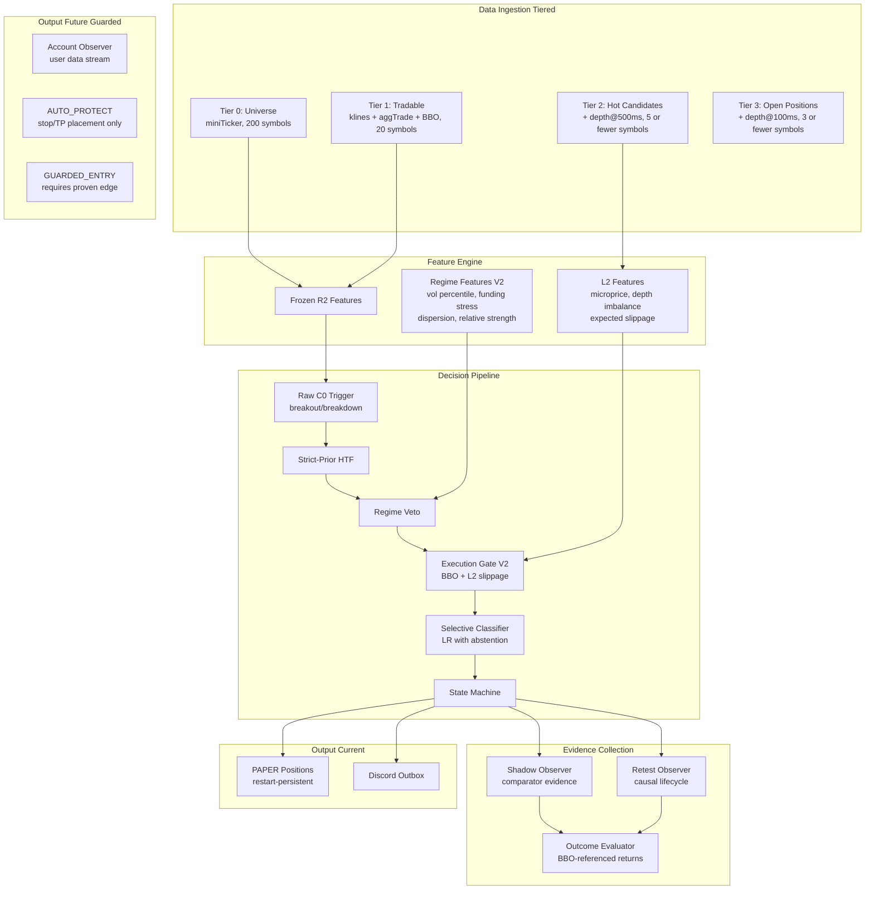

# BINANCE BOT-2

## Adversarial Quantitative, Market-Microstructure, and Production Architecture Review

**Date:** 2026-08-22 (UTC+09:00)
**Audit Scope:** Full repository adversarial review
**Classification:** Research document — no production code changes

---

## 1. Executive Summary

### Top 20 Conclusions

1. **No demonstrated after-cost edge.** The strongest available historical evidence (n ≈ 2,869, 19-fold walk-forward) shows mean net return of −25.53 bp, profit factor 0.529, strict hit 36.67%, with every fold negative. The current R2 strategy has *not* demonstrated positive after-cost expectancy.

2. **Engineering infrastructure is exceptionally strong.** The causal evidence pipeline (source freeze, append-only transitions, CAS-protected state, receipt-time-aware evaluation, explicit denominator accounting) is among the most rigorous prospective capture architectures encountered in retail/semi-professional crypto trading systems.

3. **The biggest weakness is the alpha signal itself,** not the infrastructure. The raw C0 breakout/breakdown trigger using MACD + ADX + EMA alignment is a standard momentum filter that academic literature classifies as marginal-to-negative after realistic crypto transaction costs.

4. **`causal_retest_v1` is architecturally sound** but scientifically unvalidated. It asks exactly the right question — does waiting for a structural retest improve entry quality? — but has zero completed prospective observations to date.

5. **BTC/breadth regime context is too simplistic.** The current regime model uses only BTCUSDT 1h EMA structure and mini-ticker breadth. The historical evidence shows 100% of observations recorded `regime=neutral` and `btc_trend=neutral`.

6. **L2 order book data should be added primarily for execution quality assessment**, not directional prediction. Academic evidence is clear that LOB alpha decays within seconds; 5-minute decision horizons cannot exploit it for direction.

7. **The cost model (26 bp round-trip) is realistic and properly applied.** However, the absence of historical BBO data means the cost estimate cannot be validated against actual execution conditions.

8. **The 5-minute decision frequency is cost-hostile.** At 26 bp round-trip, the strategy requires 26+ bp directional accuracy per trade. Longer horizons (15m, 1h) should be tested as they reduce cost-to-signal ratio.

9. **Top recommended research experiment:** Run the prospective shadow campaign (`shadow_er_context_v1`) for 90+ days to collect the first honest out-of-sample evidence before adding any new features.

10. **Top recommended engineering change:** Implement deterministic bar-continuity proof at restart to eliminate the `CENSORED(RESTART_GAP)` evidence loss.

11. **The probability display must NOT show P(up/down) until calibrated.** The current rule-evidence score is correctly labeled as non-probabilistic. This discipline must be preserved.

12. **Breakout failure/reversal may be a stronger candidate than continuation,** but insufficient data exists to test this with the current pipeline.

13. **Abstention/selective entry is the highest-value model improvement.** A simple logistic regression or small GBDT with a learned abstention threshold could reject trades below a cost-coverage floor.

14. **Scale-in should be the absolute last feature implemented,** after AUTO_PROTECT and guarded entry are proven safe.

15. **The OCI 2 vCPU / 12 GB environment can support ~20 symbols with L1 data.** Adding L2 depth would require tiered surveillance to stay within budget.

16. **PAPER positions are lost on restart** — this is deliberate but means prospective retest campaigns must run without interruption to preserve evidence.

17. **Multiple testing is the dominant statistical risk.** The repository correctly applies Holm correction but the number of historically inspected strategy variants already imposes a severe burden.

18. **Open-source reuse should be targeted.** vectorbt for backtesting validation, NautilusTrader concepts for future execution architecture. Wholesale migration is not justified.

19. **AUTO_PROTECT should precede automatic entry.** The first private-API milestone should be risk-reducing only.

20. **What should NOT be built yet:** Auto-entry, scale-in, deep learning models, full-depth LOB collection for the entire universe, or probability-calibrated displays.

### Current Scientific Verdict

**NOT DEMONSTRATED TO POSSESS AFTER-COST EDGE.** The strategy is a well-engineered alert system with unproven alpha. The negative historical evidence is strong enough to require fresh prospective validation before any promotion.

---

## 2. Repository Identity and Audit Scope

| Property | Value |
|---|---|
| Repository root | `<repo-root>` |
| Branch | `codex/btc-context-discord-recommendations` |
| HEAD | `39c17021b6dee4ae8b23b3af45456ca77ef080ef` |
| Dirty tree | Yes — 15 modified, 8 untracked files |
| Audit date | 2026-08-22T22:18+09:00 |

**Modified files (working tree):** `causal-retest-v1-durability.md`, `cli.py`, `config.py`, `microstructure.py`, `models.py` (domain + persistence), `repository.py`, `observer.py`, `retest.py`, `runtime.py`, `scanner.py`, `gates.py`, plus 4 test files.

**Untracked (new):** `raw_tape.py`, `retest_observer.py`, `retest_outcomes.py`, `retest_replay.py`, `smoke_audit.py`, `source_freeze.py`, plus 3 test files.

**Important:** The dirty working tree contains active Phase E/F research infrastructure. HEAD alone does not describe the running source. All audit findings reference the working-tree state as the authority.

### Files Reviewed

**Core architecture:** `README.md`, `pyproject.toml`, `config/settings.example.yaml`, `docs/ARCHITECTURE.md`, `docs/SIGNAL_SPEC.md`, `docs/BACKTEST_SPEC.md`, `docs/OPERATIONS.md`

**Signal pipeline:** `src/signalbot/config.py`, `src/signalbot/runtime.py`, `src/signalbot/scanner.py`, `src/signalbot/signals/rules.py`, `src/signalbot/signals/gates.py`, `src/signalbot/signals/state_machine.py`, `src/signalbot/signals/positions.py`, `src/signalbot/signals/shadow_policy.py`

**Data/exchange:** `src/signalbot/data/candles.py`, `src/signalbot/data/funding.py`, `src/signalbot/data/microstructure.py`, `src/signalbot/data/raw_events.py`, `src/signalbot/exchange/binance/endpoints.py`, `src/signalbot/exchange/binance/rest.py`, `src/signalbot/exchange/binance/websocket.py`, `src/signalbot/exchange/binance/universe.py`

**Prospective/retest:** `src/signalbot/prospective/observer.py`, `src/signalbot/prospective/retest.py`, `src/signalbot/prospective/retest_observer.py`, `src/signalbot/prospective/retest_outcomes.py`, `src/signalbot/prospective/retest_replay.py`, `src/signalbot/prospective/source_freeze.py`, `src/signalbot/prospective/raw_tape.py`, `src/signalbot/prospective/smoke_audit.py`

**Regime/indicators:** `src/signalbot/regime/market.py`, `src/signalbot/indicators/core.py`, `src/signalbot/indicators/structure.py`, `src/signalbot/indicators/volume.py`

**Persistence:** `src/signalbot/persistence/models.py`, `src/signalbot/persistence/repository.py`

**Evidence documents:** All 35+ files in `docs/`, including `r4b-v2-cost-survival-candidate-audit-2026-07-21.md`, `r4b-v2-directional-evidence-successor.md`, `causal-retest-v1-durability.md`, `PROSPECTIVE_CAPTURE_FOUNDATION.md`

**Tests:** `test_retest_lifecycle.py`, `test_retest_durability.py`, `test_phase_e_evidence.py`, `test_raw_tape_replay.py`, `test_smoke_audit.py`, `test_shadow_observer.py`, `test_scanner_universe_rotation.py`

---

## 3. Reconstructed Current Architecture



### Data Flow Stages

| Stage | Input | Output | Timestamps | Mutable State | Persistence | Failure Behavior |
|---|---|---|---|---|---|---|
| **Binance WS** | Raw frames | Parsed Candle/BookTicker/AggTrade | Exchange `event_time_ms` + local `receipt_time_ms` | Connection state | Optional JSONL | Reconnect with capped backoff; capacity fail-closed stop |
| **Universe** | REST 24h ticker | Tradable/surveillance/context symbol sets | Refresh every 900s | `MarketScanner.universe` | None | REST error retains existing; rotation deferred if PAPER exits exist |
| **Stores** | Parsed events | Bounded histories | Exchange time per store | Memory-bounded deques/dicts | Candles to SQLite | Gap detected triggers REST recovery before evaluation |
| **Features** | Store histories at least 210 bars | `FeatureSnapshot` | Candle `close_time_ms` | Feature history max 4 | None | Insufficient history means no evaluation |
| **Regime** | BTC 1h features + breadth | `MarketRegime` | Snapshot point-in-time query | Internal buffers | None | Missing means neutral |
| **Rules** | Feature + contexts | `RuleEvaluation` score, triggered, gate | Primary `event_time_ms` | None (pure function) | None | Gate failure means score=0 under R2 |
| **State Machine** | `RuleEvaluation` | `SignalDecision` stage transition | Event time + cooldown | Per-symbol state dict | None | Cooldown blocks re-entry for 1800s |
| **PAPER** | `SignalDecision` CONFIRMED | Technical exits | Modeled fill at next open | In-memory positions | None lost on restart | Gap cancels pending, closes positions |
| **Discord** | Persisted signal intent | Webhook delivery | Deterministic `event_id` | Outbox table | Atomic signal+outbox | 429 retry; 5xx uncertain quarantine; limit fail-closed |
| **Shadow** | Same feature/context as R2 | Comparator observations | Same causal cutoff | Coverage ledger | SQLite shadow tables | Isolated error; R2 production unchanged |
| **Retest** | Shadow observation + bars | Lifecycle transitions | Bar close + decision time | Active lifecycle index | SQLite + append-only history | CAS conflict rejected; restart means CENSORED |

---

## 4. Exact Production Signal Specification (R2)

### 4.1 Raw C0 Trigger

#### Spot BREAKOUT_LONG

```python
# src/signalbot/signals/rules.py L450-494
broke = f.price > f.recent_high and f.previous_close <= f.recent_high
macd_confirmed = f.macd_histogram > 0 and f.macd_histogram > f.macd_histogram_previous
adx_confirmed = f.adx >= 20
ema_confirmed = f.ema20 > f.ema50
triggered = broke and macd_confirmed and adx_confirmed and ema_confirmed
```

- **Prior range:** `recent_high = max(high for prior 20 bars)` (lookback=20)
- **Break condition:** Current close > recent_high AND previous close <= recent_high (first-bar breakout)
- **MACD:** Histogram > 0 AND increasing
- **ADX:** >= 20
- **EMA:** EMA20 > EMA50
- **Invalidation:** `min(recent_high, price - ATR)`

#### Futures BREAKDOWN_SHORT

```python
# src/signalbot/signals/rules.py L496-540
broke = f.price < f.recent_low and f.previous_close >= f.recent_low
macd_confirmed = f.macd_histogram < 0 and f.macd_histogram < f.macd_histogram_previous
adx_confirmed = f.adx >= 20
ema_confirmed = f.ema20 < f.ema50
triggered = broke and macd_confirmed and adx_confirmed and ema_confirmed
```

- Exact mirror of LONG with direction-appropriate signs
- **Invalidation:** `max(recent_low, price + ATR)`

### 4.2 Higher-Timeframe Context (H1)

```python
# src/signalbot/signals/gates.py L107-141
# Strict-prior: context.event_time_ms < feature.event_time_ms (NOT <=)
# Both 15m AND 1h must pass

# LONG alignment:
context.price > context.ema20 > context.ema50

# SHORT alignment:
context.price < context.ema20 < context.ema50
```

- **Maturity:** At least 210 completed bars required for feature computation
- **Strict prior:** Context event time must be strictly less than primary decision time
- **Non-compensating:** Both 15m and 1h must independently align; no averaging

### 4.3 Execution Gate (BBO)

```python
# src/signalbot/signals/gates.py L42-104
# All conditions must pass (fail-closed conjunction):
spread_bps <= 15           # maximum_spread_bps
book_age_ms in [0, 2000]   # book_maximum_age_ms
spread_is_proxy == False    # must be observed, not proxied
ask_capacity >= 100 USDT   # LONG: ask_quote_capacity
bid_capacity >= 100 USDT   # SHORT: bid_quote_capacity
```

### 4.4 Data Completeness

```python
# Heuristic: (70 + 20*flow_available + 10*spread_available) / 100
# Must meet completeness_gate = 95%
# Under R2 with observed BBO, typically evaluates to 100% or 70%
```

**Warning:** The data completeness metric is a hardcoded heuristic, not a scientifically derived readiness measure. With flow available (from aggTrade) and spread available (from bookTicker), it always evaluates to 100%. Without flow, it drops to 80%. This gate is effectively redundant under normal R2 operation.

### 4.5 State Machine

```
States: IDLE -> WATCH -> SETUP -> CONFIRMED -> (INVALIDATED)

Under R2 with confirmation_mode=explicit_trigger:
  Only triggered=True AND gate.passed can reach CONFIRMED
  Score alone cannot promote SETUP -> CONFIRMED

Cooldown: 1800 seconds after CONFIRMED
```

### 4.6 Formal R2 Decision Tree

```
IF closed_candle AND mature(>=210 bars):
  IF C0_breakout_triggered(price, MACD, ADX, EMA):
    IF strict_prior_15m_aligned AND strict_prior_1h_aligned:
      IF bbo_fresh(<=2s) AND spread(<=15bp) AND capacity(>=100USDT) AND !proxy:
        IF completeness >= 95%:
          -> CONFIRMED (eligible for Discord + PAPER)
        ELSE: gate failure
      ELSE: execution gate failure
    ELSE: HTF context failure
  ELSE: no raw C0 trigger
ELSE: insufficient data
```

---

## 5. Current Feature and Data Inventory

| Feature | Family | Production R2? | Shadow? | Prospective? | Causal? | Redundant With? | Missing Semantics |
|---|---|---|---|---|---|---|---|
| `price` (close) | Price/Trend | Yes C0 | Yes | Yes | Yes | — | Fatal |
| `previous_close` | Price/Trend | Yes C0 | Yes | Yes | Yes | — | Fatal |
| `recent_high` | Price/Structure | Yes C0 | Yes | Yes | Yes | — | Fatal requires lookback |
| `recent_low` | Price/Structure | Yes C0 | Yes | Yes | Yes | — | Fatal |
| `ema9` | Price/Trend | No | Yes exhaustion | Yes | Yes | Subset of EMA | — |
| `ema20` | Price/Trend | Yes C0+H1 | Yes | Yes | Yes | — | Fatal |
| `ema50` | Price/Trend | Yes C0+H1 | Yes | Yes | Yes | — | Fatal |
| `ema200` | Price/Trend | No | No | Yes | Yes | Correlated EMA50 | — |
| `rsi` | Price/Momentum | No | Yes exhaustion/cap | Yes | Yes | Transform of close | — |
| `macd_histogram` | Price/Momentum | Yes C0 | Yes | Yes | Yes | Transform of EMA12/26 | — |
| `macd_histogram_previous` | Price/Momentum | Yes C0 | Yes | Yes | Yes | — | — |
| `adx` | Price/Trend | Yes C0 >=20 | Yes | Yes | Yes | — | — |
| `atr` | Volatility | Yes invalidation | Yes | Yes | Yes | — | — |
| `atr_percent` | Volatility | No | Yes | Yes | Yes | Transform ATR/price | — |
| `bollinger_width_percentile` | Volatility | No | Yes squeeze | Yes | Yes | Transform std/EMA | — |
| `relative_volume` | Volume | No gated out | Yes | Yes | Yes | — | — |
| `taker_buy_ratio` | Order Flow | No gated out | Yes | Yes | Yes | Subset taker flow | — |
| `volume_zscore` | Volume | No | Yes participation | Yes | Yes | — | — |
| `trade_count_zscore` | Volume | No | Yes participation | Yes | Yes | Correlated volume | — |
| `taker_imbalance` | Order Flow | No | Yes participation | Yes | Yes | Related buy_ratio | — |
| `cvd_pressure` | Order Flow | No | Yes participation | Yes | Yes | Cumulative taker | — |
| `taker_delta_3/12` | Order Flow | No | Yes volume policy | Yes | Yes | — | Explicit reason |
| `normalized_vpci` | Volume | No | Yes volume policy | Yes | Yes | — | Explicit reason |
| `spread_bps` | Execution | Yes gate <=15bp | Yes | Yes | Yes | — | None fails gate |
| `book_age_ms` | Execution | Yes gate <=2s | Yes | Yes | Yes | — | None fails gate |
| `bid/ask_quote_capacity` | Execution | Yes gate >=100 USDT | Yes | Yes | Yes | — | None fails gate |
| `spread_is_proxy` | Execution | Yes must be false | Yes | Yes | Yes | — | Proxy fails gate |
| `funding_zscore` | Futures-specific | No | Yes crowding | Yes | Yes | — | None crowding=0 |
| `efficiency_ratio_20` | Price/Trend | No | Yes shadow ER gate | Yes | Yes | — | — |
| `chart_structure` | Structure | No | Yes pullback | Yes | Yes | — | — |
| `data_completeness` | Data Health | Yes gate >=95% | Yes | — | Yes | — | Heuristic formula |
| `regime` BTC/breadth | BTC/Context | No recorded | Yes | Yes | Yes | — | Missing neutral |

### Key Observations

1. **R2 production uses only 11 of around 30 computed features.** The majority are shadow/research-only.
2. **Massive redundancy in price/momentum family:** RSI, MACD, EMA crossovers, and ADX are all transforms of the same close price series. The project documentation correctly identifies this (r4b-v2-directional-evidence-successor.md L104-108).
3. **Order flow features exist but are gated out of R2.** The `gate_use_participation: false` setting explicitly disables taker-flow gates.
4. **No L2 features exist.** All order book information comes from L1 bookTicker (best bid/ask only).

---

## 6. Prospective / Retest Evidence Architecture Audit

### 6.1 causal_retest_v1 Lifecycle



### 6.2 Falsification Results

| # | Attack | Result | Source |
|---|---|---|---|
| 1 | One raw-C0 produces two lifecycles | **BLOCKED.** `arm()` checks `self._active` and repository; duplicate returns early | `retest_observer.py:72-124` |
| 2 | Lifecycle disappears | **BLOCKED.** Memory eviction only after terminal persist; missing-from-storage raises `RuntimeError` | `retest_observer.py:209` |
| 3 | Terminal state reopens | **BLOCKED.** `if lifecycle.terminal: return` checked before any mutation | `retest.py` |
| 4 | Duplicate events change state | **BLOCKED.** `_bar_fingerprint` hash comparison; identical no-op; conflicting `RetestConflictError` | `retest.py:465-473` |
| 5 | Future/equal HTF data enters READY | **BLOCKED.** `if context.event_time_ms >= feature.event_time_ms: raise RetestOutOfOrderError` | `retest.py:342-345` |
| 6 | Malformed data mutates lifecycle | **SAFE.** Non-positive/non-finite prices go to INVALID only, never false READY | `retest.py:511-515` |
| 7 | Campaign/source identity drift | **BLOCKED.** `source_freeze.py` hashes actual files; symlinks/reparse rejected; policy SHA binds every transition | `source_freeze.py:113` |
| 8 | Denominator selection favors READY | **BLOCKED.** `audit_retest_denominator` uses shadow observation IDs as expected registry; READY-only cannot be denominator | `repository.py` |

### 6.3 Source Freeze

- **Identity:** `worktree-source-v1:<SHA256>` computed from sorted file entries for `src/signalbot/**/*.py`, `pyproject.toml`, `uv.lock`
- **Runtime enforcement:** Observer startup rejects mismatched identity
- **Dirty-tree handling:** Naturally immune — hashes actual filesystem contents, not git diff
- **Symlink/reparse:** Explicitly rejected via `_is_reparse_or_symlink`
- **Weakness:** Git HEAD is retained as provenance but is NOT the source identity (correct design)

### 6.4 BBO Capture

- `shadow_observation_v2` carries immutable `decision_bbo_v1`: exact bid/ask prices, quantities, exchange/receipt clocks, update ID, age
- v1 observations cannot serve as exact-BBO references
- Derived spread, age, capacities all come from the same `BookState.snapshot`

### 6.5 Outcome Evaluator

```python
effective_reference_time_ms = max(decision_time_ms, bbo_receipt_time_ms)
# First included candle: open_time_ms > effective_reference_time_ms AND is_closed
```

**Partial-bar leakage:** **BLOCKED.** The strictly-after condition on `open_time_ms` prevents the BBO-formation candle from entering the outcome path.

**Horizons:** 1/3/6/12 completed 5-minute bars. Contiguous bars required; gaps produce `DATA_GAP`.

**Returns separated:**
1. Descriptive close-path return (always available)
2. Executable-BBO-entry return (requires receipt clock; otherwise `None`)
3. Cost-adjusted research return (26 bp model)

### 6.6 Replay Independence

- `ProspectiveRawTapeReplay` advances from recorded local `received_at_ms`, not exchange time
- `RepositoryLiveLikeAdapter` reads durable lifecycle; replay adapter rebuilds independently
- **No circular dependency**: tape does not reverse-engineer READY states

**Note:** The replay is software parity, not historical market validation. The absence of historical BBO data means `INCONCLUSIVE_NO_HISTORICAL_BBO` is the permanent ceiling for pre-campaign data.

---

## 7. Historical Evidence and Scientific Verdict

### 7.1 Strongest Available Evidence

Source: `docs/r4b-v2-cost-survival-candidate-audit-2026-07-21.md`

#### 19-Fold Frozen Walk-Forward (n=2,869)

| Metric | Value |
|---|---|
| Mean net return | -25.53 bp |
| Profit factor | 0.529 |
| Strict hit rate | 36.67% |
| Folds negative | **19/19** |

#### Broad 3-of-3 Consensus (Best Case: 60m horizon)

| Side | n | Mean gross | Mean net | PF | Strict hit |
|---|---|---|---|---|---|
| Long | 1,644 | +1.12 bp | -24.90 bp | 0.557 | 35.77% |
| Short | 2,081 | +0.85 bp | -25.18 bp | 0.542 | 37.05% |

#### Cost Assumptions

- 5 bp fee per side (10 bp round-trip)
- 8 bp adverse slippage per side (16 bp round-trip)
- Total: **26 bp round-trip**
- Zero-move trade costs: 26 bp before funding

### 7.2 Rejected Hypotheses

The audit document rigorously rejects:

1. **More agreeing indicators = better trade:** 3-of-3 vs 2-of-3 difference crosses zero
2. **Reverse every direction:** All ten reversal cells remain negative after cost
3. **Technical exits improve:** TE0 gives -27.00 bp (long) and -23.67 bp (short)
4. **DEV-C1 long cost-strength filter:** Chronological deterioration from +15.14 to -11.47 to -29.49 bp

### 7.3 Scientific Verdict

| Classification | Assessment |
|---|---|
| Evidence of no demonstrated edge | **YES** — strong. 19/19 folds negative after cost. |
| Evidence of negative expectancy | **PROBABLE** — gross returns near zero; cost dominates. |
| Absence of evidence | Not applicable — substantial sample exists. |
| Inability to validate execution | **YES** — no historical BBO means live fill quality unknown. |

**Important:** The historical evidence is sufficient to conclude: **the current R2 strategy has not demonstrated positive after-cost edge.** The gross directional return is approximately zero across all tested horizons, and the 26 bp cost floor is not cleared by any pre-registered variant.

### 7.4 Limitations of Historical Evidence

1. **Universe:** Only 7 assets (BONK, ENA, WIF, FLOKI, ARB, OP, SEI) — cannot generalize to BTC/ETH
2. **No historical BBO:** Full R2 execution gate untestable historically
3. **Regime homogeneity:** 100% of observations show `regime=neutral, btc_trend=neutral`
4. **Survival bias:** Current universe excludes delisted tokens from the period
5. **Point-in-time universe reconstruction:** Not demonstrated for historical universe membership

---

## 8. Critical Bugs / Weaknesses / Missing Guarantees

### P0 — Must fix before production reliance

| ID | Type | Description | Source |
|---|---|---|---|
| P0-1 | Missing evidence | **No demonstrated after-cost edge.** Strategy should not be promoted to capital commitment without fresh prospective evidence. | Historical audit |
| P0-2 | Operational risk | **PAPER positions lost on restart.** Any process restart during a prospective campaign destroys open PAPER state and triggers `CENSORED(RESTART_GAP)` for all active retest lifecycles. | `SIGNAL_SPEC.md:92-95` |
| P0-3 | Architecture | **No bar-continuity proof at startup.** The runtime does not verify exact completed-bar continuity, so `CENSORED(RESTART_GAP)` is always applied. This means every restart loses prospective evidence. | `causal-retest-v1-durability.md:109-111` |

### P1 — Should fix for scientific rigor

| ID | Type | Description | Source |
|---|---|---|---|
| P1-1 | Scientific flaw | **Regime model produces only `neutral`.** Historical evidence shows 100% neutral regime/trend. The model fails to discriminate any market condition. | `r4b-v2-cost-survival-candidate-audit.md:88-89` |
| P1-2 | Scientific flaw | **Data completeness is a heuristic non-gate.** Under R2 with flow + BBO, it always evaluates to 100%. It does not measure actual data quality. | `rules.py` analysis |
| P1-3 | Missing evidence | **No prospective shadow observations collected yet.** The campaign is `READY_FOR_CONTINUOUS_START` but has not been activated on the deployment host. | `prospective-shadow-campaign-2026-08-19.md:7-8` |
| P1-4 | Architecture | **Windows directory fsync limitation.** POSIX fsyncs parent directory; Windows has no portable equivalent. Segment finalization may not survive power loss. | `PROSPECTIVE_CAPTURE_FOUNDATION.md:180-181` |

### P2 — Should fix for production quality

| ID | Type | Description | Source |
|---|---|---|---|
| P2-1 | Architecture | **BookTicker cursor conflict handling.** Conflicting cursors (same update ID, different prices) are discarded with a log. This is correct but silently drops valid updates if Binance sends incremented IDs with overlapping content. | `microstructure.py` |
| P2-2 | Architecture | **Rate limit enforcement is process-local.** Spot depth snapshot pacer cannot account for other processes sharing the public IP. | `PROSPECTIVE_CAPTURE_FOUNDATION.md:130-132` |
| P2-3 | Missing guarantee | **Shadow observation isolation.** Shadow errors are caught with bare `except Exception`, which correctly isolates R2 but may swallow diagnostic-critical errors. | `runtime.py:353` |
| P2-4 | Architecture | **Outbox uncertain quarantine has no automatic resolution.** Transport errors and 5xx responses create `uncertain` entries that require manual operator review. | `ARCHITECTURE.md:58-62` |

### P3 — Desirable improvements

| ID | Type | Description | Source |
|---|---|---|---|
| P3-1 | Architecture | **Feature history bounded at 4.** While sufficient for current indicators, any future rolling feature needing more lookback would require increasing this. | `runtime.py` |
| P3-2 | Architecture | **Funding z-score requires 20+ data points.** New symbols will not have funding evidence for several days. | `settings.example.yaml:59` |
| P3-3 | Architecture | **No structured alerting for operator when regime model is saturating.** Always-neutral regime produces no operational signal. | Analysis |

---

## 9. Latest Binance API / Infrastructure Audit

### 9.1 WebSocket Architecture (Current as of Aug 2026)

| Property | Value | Source |
|---|---|---|
| Futures Public | `wss://fstream.binance.com/public` | Binance USDS-M docs |
| Futures Market | `wss://fstream.binance.com/market` | Binance USDS-M docs |
| Futures Private | `wss://fstream.binance.com/private` | Binance USDS-M docs |
| Spot Combined | `wss://stream.binance.com:9443/stream?streams=` | Binance Spot docs |
| Ping/pong | Server ping every 3 min; client must respond within 10 min | Official docs |
| Max streams per conn | 1,024 | Official docs |
| Max messages per sec | 10 incoming per connection | Official docs |

**Bot implementation:** Correctly uses routed endpoints. `endpoints.py` separates Futures into `/public` (bookTicker) and `/market` (klines, aggTrade, miniTicker). Connection recycling at `max_connection_age_seconds=85800` (less than 24h).

**Note:** The legacy combined Futures WebSocket URLs were retired in April 2026. The bot's routing is current.

### 9.2 Local Order Book Management

| Step | Binance Requirement | Bot Status |
|---|---|---|
| Buffer depth events | Required | Implemented in capture pipeline |
| REST snapshot | Required | `GET /fapi/v1/depth?limit=1000` |
| Discard u <= lastUpdateId | Required | Venue-specific rules applied |
| First event U <= lastUpdateId <= u | Required | Validated |
| pu continuity (Futures) | Required | `pu` must match previous `u` |
| Gap detection | Required | Gap triggers resnapshot |
| Spot vs Futures semantics | Required | Correctly differentiated (Spot: `lastUpdateId + 1`) |

**Status:** The capture pipeline (`LocalBookMaterializer`) correctly implements the Binance procedure. The live scanner uses only L1 bookTicker, not full-depth updates.

### 9.3 Key Market Data Streams

| Stream | Used in Bot? | Notes |
|---|---|---|
| `bookTicker` | Yes via /public | BBO spread, capacity, age |
| `aggTrade` | Yes via /market | Taker buy/sell ratio, flow |
| `kline_5m/15m/1h/4h` | Yes via /market | Primary decision clock |
| `!miniTicker@arr` | Yes via /market | Breadth anomaly detection |
| `markPrice` | No | Available at 1s for futures |
| `forceOrder` | No | Liquidation stream available |
| `depth@100ms` | No capture only | Not in live scanner |
| `fundingRate` | Yes via REST | Polled every 300s |

### 9.4 Futures Execution Architecture (Research Only)

| Feature | Current Status | Notes |
|---|---|---|
| Order types | N/A | Market, Limit, Stop-Market, TP, Trailing supported |
| Position mode | N/A | One-way or Hedge mode available |
| Reduce-only | N/A | Can only reduce/close position |
| User Data Stream | N/A | `listenKey` via REST, 60-min keep-alive |
| Client order ID | N/A | Required for deterministic reconciliation |
| Rate limits | N/A | approx 2,400 weight/min IP; approx 1,200 orders/min account |

---

## 10. External Academic Evidence Review

### 10.1 Breakout Trading in Crypto

**Dobrynskaya, V. (2023). "Cryptocurrency Momentum and Reversal."**
- Short-term momentum exists in crypto but diminishes rapidly after costs
- Transfer to 5-minute Binance: **Limited.** Momentum evidence is primarily daily/weekly
- Classification: **PLAUSIBLE** for breakout continuation; **CONTRADICTED** for after-cost profitability at 5-minute frequency

**Sullivan, Timmermann, White (1999). "Data-snooping, technical trading rule performance, and the bootstrap." JF 54(5). DOI: 10.1111/0022-1082.00163**
- Technical trading rules appear profitable but significance vanishes after multiple-testing correction
- Transfer: **DIRECTLY APPLICABLE.** The bot's own historical evidence confirms this finding
- Classification: **ESTABLISHED** (that correction is necessary)

### 10.2 Retest / Pullback

No peer-reviewed paper directly validates "breakout to retest to recovery to continuation" as a strategy with positive after-cost expectancy on 5-minute crypto data. Practitioner literature (Smart Money Concepts) supports the mechanism but without rigorous statistical testing.

- Classification: **HYPOTHESIS / PLAUSIBLE** — the right question to test prospectively

### 10.3 Order Flow Imbalance

**Cont, Kukanov, Stoikov (2014). "The price impact of order book events." JFINEC 12(1). DOI: 10.1093/jjfinec/nbt003**
- Order flow imbalance (OFI) is a strong predictor of next-tick/next-few-second returns
- **Transfer limitation:** Effect decays within seconds; 5-minute aggregation likely destroys most predictive power for direction
- **Execution use:** Remains valid for assessing fill quality at decision time
- Classification: **ESTABLISHED** for sub-second; **PLAUSIBLE** for 5-minute direction; **SUPPORTED** for execution quality

**Kolm, Turiel, Westray (2023). "Deep order flow imbalance." MathFin 33(4). DOI: 10.1111/mafi.12413**
- LOB features outperform price-only for HF prediction
- **Transfer:** Confirms L2 is useful but on a much shorter horizon than 5 minutes
- Classification: **ESTABLISHED** for HF; **PLAUSIBLE** for 5-minute direction

### 10.4 Statistical Validation

**Bailey, Borwein, Lopez de Prado, Zhu (2014). "The Deflated Sharpe Ratio." JCF. DOI: 10.21314/JCF.2016.322**
- Adjusts Sharpe ratio for selection bias, non-normality, and number of trials
- Classification: **ESTABLISHED** — already referenced in the project

**Bailey et al. (2017). "Probability of Backtest Overfitting (PBO)."**
- CSCV quantifies the probability that an in-sample optimal strategy is out-of-sample worst
- Classification: **ESTABLISHED**

### 10.5 Meta-labeling and Triple Barrier

**Lopez de Prado (2018). "Advances in Financial Machine Learning." Wiley.**
- Triple barrier (profit/stop/time) creates path-dependent labels
- Meta-labeling trains a secondary model on primary signal success probability
- Classification: **ESTABLISHED** methodology; **PLAUSIBLE** for this specific system

### 10.6 Regime Detection

**Various (2019-2025). HMM and regime-switching models for crypto.**
- HMMs can classify momentum vs. mean-reversion regimes
- Path signature and hybrid approaches are emerging
- Classification: **SUPPORTED** for the concept; **PLAUSIBLE** for practical incremental value

---

## 11. Strategy-Family Review

| Family | Mechanism | Evidence Level | Transfer to Bot | Priority |
|---|---|---|---|---|
| **Breakout continuation** | Range escape then trend continuation | PLAUSIBLE | Current incumbent; negative historical evidence | BASELINE |
| **Causal retest** | Breakout then retest then recovery | HYPOTHESIS | Architecturally ready; zero prospective evidence | HIGH |
| **Failed breakout reversal** | False escape then reversal | PLAUSIBLE | Not currently tested; may be stronger than continuation | MEDIUM |
| **Short-horizon momentum** | Intraday trend following | SUPPORTED daily; PLAUSIBLE 5m | Partially captured by EMA/MACD | LOW redundant |
| **Mean reversion** | Overextension then revert | SUPPORTED | Not implemented; regime-dependent | MEDIUM |
| **Post-liquidation cascade** | Forced liquidations produce opportunity | PLAUSIBLE | `forceOrder` stream available; data quality uncertain | LOW |
| **Relative strength** | Symbol movement relative to BTC/market | SUPPORTED | `CROSS_SECTIONAL_CONTEXT_EX_TARGET` exists in design | MEDIUM |
| **Cross-sectional selection** | Rank opportunities across symbols | PLAUSIBLE | No current ranking mechanism | MEDIUM |

---

## 12. Market-Regime Upgrade

### Current State

The regime model (`MarketRegimeEngine`) uses BTC 1h EMA structure and all-market breadth from mini-tickers. Historical evidence shows it produces `neutral` for 100% of observations. This is equivalent to having no regime model.

### Recommended Ablation Protocol

Test these features incrementally against the baseline (no regime filter):

| Feature | Information Source | Incremental to Price? | Data Available? | Overfitting Risk |
|---|---|---|---|---|
| **BTC realized volatility** | ATR/close-to-close vol | Moderate | Yes klines | Low |
| **Volatility percentile** | Rolling rank of vol | Moderate | Yes | Low |
| **Cross-sectional dispersion** | Std of returns across universe | High | Yes mini-ticker | Low |
| **BTC EMA trend** improved | Longer lookback, momentum-based | Low correlated with C0 | Yes | Low |
| **Funding stress** | Aggregate funding z-score | High independent source | Yes REST | Medium |
| **Correlation spike** | BTC correlation to altcoins | High | Moderate requires computation | Medium |
| **Breadth improvement** | Pct above EMA20 instead of binary | Moderate | Yes mini-ticker | Low |

**Protocol:**
1. Freeze current R2 as M0 comparator
2. For each candidate: add as a veto only (reject trades in adverse regime)
3. Measure: rejection rate, mean net return of accepted vs. rejected, hit-rate lift
4. Reject if: accepted subset does not improve after cost OR sample < 200 per regime bucket
5. Promote if: consistent lift across 3+ chronological folds after Holm correction

**Warning:** Adding regime features creates a search dimension. Each additional tested regime variant increases the multiple-testing burden. Preregister at most 3 regime candidates simultaneously.

---

## 13. Microstructure / L2 Proposal

### Assessment

| Use Case | Value | Evidence | Priority |
|---|---|---|---|
| **Execution quality gate** | HIGH | Established — spread, depth, microprice improve fill assessment | P1 |
| **Directional prediction** | LOW | Effect decays in seconds; 5-minute horizon too slow | P3 |
| **Opportunity veto** | MODERATE | Thin book means reject entry; prevents bad fills | P1 |

### Recommendation

**Add limited L2 primarily for execution assessment, not direction.**

### Resource-Bounded Implementation

```
Tier 0 — Full eligible universe (approx 200 symbols):
  miniTicker only (already implemented)
  Cost: approx 1 stream, negligible memory

Tier 1 — Tradable universe (approx 20 symbols):
  kline_5m + aggTrade + bookTicker (current)
  Cost: approx 80 streams, approx 60 MB

Tier 2 — Hot candidates (up to 5 symbols):
  + depth@500ms (partial depth, top 5-10 levels)
  Cost: approx 5 additional streams, approx 25 MB
  Purpose: execution quality, microprice, depth imbalance

Tier 3 — Open positions (up to 3 symbols):
  + depth@100ms (if future execution requires)
  Cost: approx 3 additional streams, approx 15 MB
  Purpose: protective order placement, exit optimization
```

**Total estimated memory for Tiers 0-2:** approx 100 MB well within 12 GB budget.

### L2 Features Worth Computing (Tier 2 Only)

| Feature | Formula | Use |
|---|---|---|
| Microprice | `(bid * ask_qty + ask * bid_qty) / (bid_qty + ask_qty)` | Fair value estimate |
| Depth imbalance top-5 | `(sum bid_qty - sum ask_qty) / (sum bid_qty + sum ask_qty)` | Short-horizon direction hint |
| Expected slippage | `VWAP(levels, notional) - mid` | Execution cost estimate |
| Book resilience | Rate of depth recovery after take | Execution timing |
| Spread dynamics | Rolling spread percentile | Execution opportunity window |

---

## 14. Cost and Execution Model

### Current Model

| Component | Value | Source |
|---|---|---|
| Fee per side | 5 bp | Settings `round_trip_cost_bps: 26` |
| Adverse slippage per side | 8 bp | Historical estimate |
| Round-trip total | 26 bp | Frozen in research |
| Stress test | 34 bp | Used for robustness check |
| Funding | Recorded separately | Per-position actual funding |

### Cost Model Assessment

The 26 bp round-trip assumption is **realistic and conservatively applied.** Binance Futures standard taker fee is 4 bp per side (8 bp round-trip). The 8 bp slippage per side is reasonable for 100 USDT notional on liquid pairs but may be too conservative for top-10 pairs and too optimistic for lower-liquidity symbols.

### Signal Alpha vs Execution Alpha vs Cost Avoidance

| Category | Description | Example |
|---|---|---|
| **Signal alpha** | Feature improves directional accuracy | Better regime filter increases hit rate |
| **Execution alpha** | Feature improves fill quality | Wait for spread compression before entry |
| **Cost avoidance** | Feature avoids bad trades | Reject thin-book entries where slippage dominates |

**Important:** A feature can improve net returns WITHOUT improving directional accuracy by avoiding entries where cost exceeds expected edge. The execution gate (BBO spread <= 15bp, capacity >= 100 USDT) already does this partially. L2 depth would make it more precise.

---

## 15. Selective Prediction V1

### Current Approach

The bot uses a rule-based conjunction (C0 + H1 + BBO gate). There is no learned model, no probability output, and no explicit abstention mechanism beyond the gate failures.

### Recommended Architecture

```
Rules-first -> Selective classifier -> Abstention threshold

Step 1: Keep R2 C0 as trigger (generates candidates)
Step 2: Train regularized logistic regression on:
  - C0 features at trigger time
  - HTF context features
  - regime features
  - BBO execution quality metrics
  - Target: barrier outcome (hit vs. miss vs. timeout)
Step 3: Calibrate probabilities (isotonic regression on validation set)
Step 4: Define abstention threshold:
  - Enter only if P(target) > P(stop) + cost_margin
  - Minimum P(target) floor (e.g., 0.55)
```

### Model Comparison

| Model | Pros | Cons | Recommendation |
|---|---|---|---|
| Rules only | Interpretable, no overfitting | Fixed, no learning | Current incumbent |
| Logistic regression | Interpretable, calibration-friendly, low overfit risk | Linear features only | **RECOMMENDED for V1** |
| Small GBDT 100 trees depth 3 | Captures interactions | Overfit risk with small n | Test as V2 only after LR baseline |
| Neural network / transformer | Flexible | Massive overfit risk, uncalibratable with small sample | **REJECT** |

### Why Logistic Regression First

1. Sample size (approx 3,000 historical opportunities) is too small for complex models
2. LR produces calibrated probabilities natively
3. L1-regularized LR performs automatic feature selection
4. Easy to inspect which features contribute
5. Can serve as the baseline for any future model comparison

---

## 16. Target / Label Design

### Options

| Target | Pros | Cons | Recommendation |
|---|---|---|---|
| **Direction** up/down | Simple | Ignores magnitude, does not account for stops | Baseline only |
| **Barrier outcome** hit TP before SL before timeout | Path-dependent, realistic | Requires TP/SL definition, 3-class | **RECOMMENDED** |
| **MFE/MAE** | Rich information | Regression targets need more data | Research |
| **Expected net edge** | Directly actionable | Requires cost model in label | Too complex for V1 |

### Recommended Barrier Outcome Definition

```
Triple barrier with:
  Upper: +X ATR (profit target)
  Lower: -Y ATR (stop loss)
  Vertical: Z bars (time limit)
Outcome: PROFIT / LOSS / TIMEOUT
Label: PROFIT = 1, LOSS = 0, TIMEOUT = 0
```

The triple barrier method (Lopez de Prado, 2018) is established methodology that handles path dependency correctly.

---

## 17. Statistical Validation and Anti-Overfitting Protocol

### Smallest Defensible Stack

| Test | Question It Answers | When to Use |
|---|---|---|
| **Chronological walk-forward** | Does the strategy work out-of-sample? | Always — primary validation |
| **Purging + embargo** | Are train/test labels contaminated? | Always — default 72-bar purge |
| **Moving-block bootstrap** 7-day | What is the uncertainty on performance metrics? | Always — confidence intervals |
| **Holm correction** | Are multiple candidates significant after correction? | When testing more than 1 strategy variant |
| **Deflated Sharpe Ratio** | Would this Sharpe ratio be surprising given the number of trials? | After selecting from multiple strategies |
| **One-time locked holdout** | Final go/no-go on an already-selected strategy | Once per strategy promotion decision |
| **Prospective shadow** | Does it work on truly unseen future data? | Gold standard — already designed |

### What NOT to Add

- CSCV/PBO: Useful conceptually but requires many sub-samples; current sample size (n approx 3,000) is marginal
- Hansen SPA: Adds complexity without changing the conclusion when all candidates are negative
- FDR correction: Holm is sufficient for the expected number of candidates (less than 10)

### Multiple Testing Governance

```
RULE: Each new pre-registered experiment variant counts against
      the Holm family-wise error budget.

RULE: Changing any threshold, horizon, direction, endpoint, or
      exclusion after seeing results requires a NEW preregistration
      and FRESH untouched sample.

RULE: The historical sample is EXHAUSTED for the current strategy family.
      Further optimization on the same 7-asset 5-minute dataset
      cannot produce credible evidence.
```

---

## 18. Infrastructure / Resource Plan

### OCI 2 vCPU / 12 GB Budget Estimate

| Component | Estimate | Notes |
|---|---|---|
| **Python runtime** | approx 200 MB | Baseline interpreter + libraries |
| **CandleStore** 20 symbols x 5 intervals x 600 bars | approx 120 MB | `Candle` objects |
| **OrderFlowTracker** 20 symbols x 10k trades | approx 200 MB | `AggTrade` deque |
| **BookState** 20 symbols | approx 10 MB | BBO snapshots |
| **Feature history** 20 symbols x 4 snapshots | approx 20 MB | `FeatureSnapshot` objects |
| **SQLite** | approx 100 MB | Signals, candles, shadow evidence |
| **Raw events if enabled** | 10 GB cap | JSONL on disk |
| **L2 depth Tier 2 5 symbols** | approx 25 MB | Top 5-10 levels |
| **Total RAM** | approx 700 MB + headroom | Well within 12 GB |
| **CPU** | approx 15-20% sustained | Feature computation on 5m closes |

**Verdict:** 2 vCPU / 12 GB is **sufficient** for the current architecture with 20 symbols + Tier 2 L2 on 5 hot candidates. CPU spikes at 5-minute bar closes when all 20 symbols compute features simultaneously.

### Where Measurements Are Required

1. **aggTrade event rate** during volatile periods — could spike to 1000+/sec per symbol
2. **SQLite write contention** under full shadow + retest observation
3. **Feature computation time** per 5-minute close across 20 symbols
4. **WebSocket reconnection thundering herd** after outage

---

## 19. Open-Source Reuse Analysis

| Project | Stars | License | Useful Components | Worth Incorporating? |
|---|---|---|---|---|
| **Freqtrade** | approx 35K | GPL-3 | Backtesting harness, lookahead analysis, Binance exchange class | Borrow backtesting validation concepts; do NOT migrate |
| **NautilusTrader** | approx 22K | LGPL-3 | Execution engine, risk engine, order management architecture | Study architecture for future AUTO_PROTECT; too heavy to embed |
| **vectorbt** | approx 12K | Apache-2 | Fast vectorized backtesting, portfolio simulation | Useful for validation cross-checks on historical data |
| **Hummingbot** | approx 19K | Apache-2 | Binance connector, market-making strategies | Connector code reference; strategies not applicable |
| **Jesse** | approx 7K | MIT | Strategy development framework, Binance Futures support | License-friendly but architecture mismatch |

### Recommendation

1. **vectorbt** for independent backtesting cross-validation (Apache-2 license, embeddable)
2. **NautilusTrader architecture** as reference for future execution/risk engine (study, do not embed)
3. **Freqtrade** `lookahead-analysis` and `recursive-analysis` for leakage detection (already referenced in `BACKTEST_SPEC.md`)

Do NOT wholesale migrate to any framework. The current architecture's causal evidence pipeline is more sophisticated than any of these systems offer.

---

## 20. Future Risk / Execution / Position Guardian Architecture

### Recommended Progression

```
Level 0: ALERT_ONLY           <-- CURRENT
Level 1: ACCOUNT_OBSERVE       Requires: listenKey, user data stream
Level 2: AUTO_PROTECT          Requires: stop/TP placement, reduce-only
Level 3: GUARDED_AUTO_ENTRY    Requires: full order lifecycle, reconciliation
Level 4: GUARDED_SCALE_IN      Requires: position sizing, add logic
```

### AUTO_PROTECT (Level 2) Analysis

**Risk-reducing only principle:**

| Action | Level 2 | Level 3 | Level 4 |
|---|---|---|---|
| OPEN NEW EXPOSURE | Forbidden | Allowed guarded | Allowed |
| INCREASE EXPOSURE | Forbidden | Forbidden | Allowed guarded |
| PLACE PROTECTION | Allowed | Allowed | Allowed |
| TIGHTEN PROTECTION | Allowed | Allowed | Allowed |
| REDUCE POSITION | Allowed | Allowed | Allowed |
| CLOSE POSITION | Allowed | Allowed | Allowed |

**Binance requirements for Level 2:**
1. API key with Futures trading permission
2. User Data Stream (`wss://fstream.binance.com/private`) via `listenKey`
3. Position mode set (recommend one-way for simplicity)
4. `STOP_MARKET` or `TAKE_PROFIT_MARKET` with `reduceOnly=true`
5. Deterministic `newClientOrderId` for reconciliation
6. Execution-status-unknown handling (429, timeout, network error)
7. Restart recovery: query open orders + positions at startup

### P0 Architecture Before Any Private API

| Requirement | Description |
|---|---|
| Deterministic client order ID | `f"{intent_id}_{attempt}"` — idempotent retry |
| Intent ledger | Append-only record of every order intent with status |
| Position reconciliation | Periodic REST query to verify expected vs actual position |
| Status-unknown handler | Log, retry with same client ID, verify outcome |
| Kill switch | Operator can instantly cancel all orders + close all positions |
| Rate limit budget | Separate order rate tracking from market data rate tracking |
| Risk authority | Single module that controls maximum exposure, never bypassed |

---

## 21. Scale-In Research Protocol

### Design Principles

| Principle | Rationale |
|---|---|
| **Preplanned add** | Scale-in level defined at entry, not improvised |
| **New independent confirmation** | Cannot add on price alone; requires fresh signal |
| **Thesis still valid** | Original invalidation level not breached |
| **Fixed maximum initial loss budget** | Total risk (original + add) <= original budget |
| **Maximum gross notional** | Hard cap on total position size |
| **Leverage cap** | 5x or less regardless of thesis quality |
| **Liquidation distance floor** | At least 2x ATR from current price to liquidation |
| **Maximum add count** | 1 add maximum (no pyramiding) |
| **No stop widening** | Original stop stays; add uses tighter or same stop |
| **Execution quality gate** | Add must pass same BBO/spread gate as original entry |

### Comparison: No Scale-In vs One Scale-In

Under the SAME risk budget:

| Scenario | Entry | Add | Total Notional | Stop Distance | Max Loss |
|---|---|---|---|---|---|
| No scale-in | full at price A | — | full | original stop | budget |
| One scale-in | half at price A | half at better price | full | tighter stop | same budget |

Scale-in gets better average entry IF thesis holds, but same maximum loss. It produces worse outcome if the thesis was wrong and the add accelerated losses before the stop.

**Caution:** Scale-in should be the LAST promoted layer (Level 4). It requires: proven AUTO_PROTECT, proven GUARDED_AUTO_ENTRY, proven positive expectancy, and a separate prospective validation campaign specifically testing the scale-in variant.

---

## 22. Candidate Ablation Ladder

```
M0: Frozen R2 (current incumbent)
    Purpose: Baseline. Collect prospective evidence.
    Status: ACTIVE

M1: + Improved regime veto (volatility percentile + funding stress)
    Purpose: Reject entries in hostile regimes.
    Hypothesis: Regime veto reduces false signals without reducing true signals.
    Prerequisite: M0 prospective data collected (90+ days)

M2: + Relative state (symbol vs BTC cross-sectional context)
    Purpose: Add independent information from market common factor.
    Hypothesis: Breakouts aligned with sector flow have higher quality.
    Prerequisite: M1 validated or rejected

M3: + L2 execution quality gate (microprice, expected slippage)
    Purpose: Reject entries with poor execution conditions.
    Hypothesis: Cost avoidance improves net returns.
    Prerequisite: L2 infrastructure implemented

M4: + Selective classifier (logistic regression with abstention)
    Purpose: Learn which C0 triggers are most likely to succeed.
    Hypothesis: Learned abstention outperforms fixed rules.
    Prerequisite: M0-M3 prospective data for training

M5: Causal retest comparison
    Purpose: Test whether retest entry outperforms raw breakout entry.
    Hypothesis: Waiting for structural retest improves entry quality.
    Prerequisite: Sufficient READY events in prospective data

M6: + Barrier outcome targets (triple barrier)
    Purpose: Replace fixed-horizon with path-dependent labels.
    Hypothesis: Better labels improve model discrimination.
    Prerequisite: M4 baseline established
```

---

## 23. Recommended Prospective Experiments

### E1: Shadow Campaign Activation

| Field | Value |
|---|---|
| Candidate ID | `PROSP-E1-SHADOW-2026` |
| Hypothesis | The er_context_v1 shadow policy identifies a subset of R2 opportunities with improved net returns |
| Frozen inputs | C0, H1, BBO evidence, ER20, anti-chase ATR, BTC context |
| Frozen thresholds | ER20 >= 0.40, breakout <= 0.5 ATR, cost headroom 2x26bp, BTC opposition veto |
| Comparator | Frozen R2 on same opportunity IDs |
| Metrics | Mean net return, hit rate, profit factor, MFE, MAE (both shadow-pass and shadow-fail) |
| Horizon | 1/3/6/12 5-minute bars |
| Sample requirement | At least 300 observations, at least 50 per chronological third, at least 5 assets |
| Promotion rule | Shadow-pass mean net return > 0 AND lower CI > -5bp after Holm correction |
| Rejection rule | Shadow-pass <= shadow-fail after 300 observations |

### E2: Regime Veto

| Field | Value |
|---|---|
| Candidate ID | `PROSP-E2-REGIME-VETO-2026` |
| Hypothesis | Rejecting entries during high-volatility-percentile or extreme-funding regimes improves net returns |
| Frozen inputs | BTC realized vol percentile, aggregate funding z-score |
| Frozen thresholds | Reject if vol_percentile > 90th OR abs(funding_z) > 2.0 |
| Comparator | All R2 opportunities without regime filter |
| Metrics | Rejection rate, accepted mean net return, accepted profit factor |
| Sample requirement | At least 200 accepted observations |
| Promotion rule | Accepted mean net > total mean net AND accepted PF > 1.0 |
| Rejection rule | Rejection rate > 50% OR no improvement after 200 accepted |

### E3: Causal Retest Quality

| Field | Value |
|---|---|
| Candidate ID | `PROSP-E3-RETEST-QUALITY-2026` |
| Hypothesis | READY-state retest entries have better mean net return than raw C0 entries |
| Frozen inputs | Lifecycle state, breakout level, touch price, recovery price |
| Frozen thresholds | Standard causal_retest_v1 parameters |
| Comparator | Same opportunity at raw C0 time (from shadow observation) |
| Metrics | Mean net return difference (READY minus RAW), paired test |
| Sample requirement | At least 100 READY events |
| Promotion rule | READY mean net > RAW mean net AND lower CI > 0 |
| Rejection rule | READY mean net <= RAW mean net after 100 READY events |

### E4: L2 Execution Gate

| Field | Value |
|---|---|
| Candidate ID | `PROSP-E4-L2-EXEC-2026` |
| Hypothesis | Rejecting entries where expected slippage > 5bp improves net returns |
| Frozen inputs | Top-5 depth levels, microprice, expected VWAP for 100 USDT |
| Frozen thresholds | Reject if expected_slippage > 5bp |
| Comparator | All R2 opportunities without L2 filter |
| Metrics | Rejection rate, accepted mean net return |
| Sample requirement | At least 150 accepted observations |
| Promotion rule | Accepted mean net > 0 AND accepted PF > 1.0 |
| Rejection rule | No improvement after 150 accepted |

### E5: Logistic Regression Selective Entry

| Field | Value |
|---|---|
| Candidate ID | `PROSP-E5-LOGREG-SELECTIVE-2026` |
| Hypothesis | A regularized LR with learned abstention threshold outperforms fixed R2 gates |
| Frozen inputs | All M0-M3 features at C0 time |
| Frozen thresholds | L1 regularization lambda selected by walk-forward CV; abstention at P(profit) < 0.55 |
| Comparator | Frozen R2 |
| Metrics | Mean net return, Brier score, calibration curve, entry rate |
| Sample requirement | At least 500 prospective observations for training + 200 for validation |
| Promotion rule | Mean net > R2 mean net AND Brier < R2-equivalent AND entry rate > 20% |
| Rejection rule | Brier > 0.25 OR calibration ECE > 0.10 |

---

## 24. Prioritized Roadmap

### Research Priorities

| Priority | Item | Rationale |
|---|---|---|
| **NOW** | Activate prospective shadow campaign (E1) | Only way to get honest out-of-sample evidence |
| **NOW** | Measure regime model discrimination | Current model produces only neutral |
| **NEXT** | Design and implement improved regime veto (E2) | Highest expected information gain for lowest complexity |
| **NEXT** | Collect retest lifecycle data (E3 prerequisite) | Requires sustained campaign operation |
| **LATER** | Train logistic regression on prospective data (E5) | Requires 500+ observations |
| **LATER** | Compare breakout vs. retest vs. reversal | Requires sufficient events of each type |
| **DO NOT BUILD YET** | Deep learning models | Sample size vastly insufficient |
| **DO NOT BUILD YET** | Full probability calibration display | No calibrated model exists |

### Engineering Priorities

| Priority | Item | Rationale |
|---|---|---|
| **NOW** | Implement bar-continuity proof at restart (P0-3) | Eliminates CENSORED(RESTART_GAP) evidence loss |
| **NOW** | Add restart-persistent PAPER position snapshot | Prevents evidence loss on restart |
| **NEXT** | Implement Tier 2 L2 depth collection (hot candidates) | Needed for E4 and cost model improvement |
| **NEXT** | Implement versioned cost model V2 | Separates fixed and dynamic cost components |
| **LATER** | User Data Stream integration (Level 1: ACCOUNT_OBSERVE) | Prerequisite for AUTO_PROTECT |
| **LATER** | Deterministic client order ID + intent ledger | Prerequisite for any order placement |
| **DO NOT BUILD YET** | Order placement / execution | No demonstrated edge to justify |
| **DO NOT BUILD YET** | Scale-in logic | Requires proven AUTO_PROTECT + proven entry |

### Production Safety Priorities

| Priority | Item | Rationale |
|---|---|---|
| **NOW** | Ensure shadow campaign can run 90+ days without restart | Continuous evidence is critical |
| **NOW** | Monitor SQLite write performance under full shadow + retest | May need WAL mode tuning |
| **NEXT** | Add structured operator alerts for regime saturation | Detect when model is not discriminating |
| **NEXT** | Add outbox uncertain resolution pathway | Currently requires manual review |
| **LATER** | Risk authority module design | Before any private API |
| **DO NOT BUILD YET** | Auto-entry or auto-protect | No edge demonstrated |

---

## 25. Final Target Architecture



---

## 26. Final Recommendations

### Keep Unchanged

1. **R2 C0 breakout/breakdown trigger** — it is the frozen incumbent and the baseline for all experiments
2. **Strict-prior HTF context** — causally sound and correctly implemented
3. **BBO execution gate** — fail-closed, proxy-rejecting, capacity-checking
4. **Append-only transition history** — gold-standard evidence governance
5. **Source freeze with SHA-256** — reproducibility guarantee
6. **No order placement** — correct until edge is demonstrated
7. **26 bp cost model** — realistic and properly applied
8. **Outbox atomic persistence** — no duplicate Discord messages

### Improve Immediately

1. **Bar-continuity proof at restart** — eliminate `CENSORED(RESTART_GAP)` evidence loss
2. **Start prospective shadow campaign** — only path to genuine out-of-sample evidence
3. **Implement restart-persistent PAPER snapshot** — preserve evidence across restarts
4. **Replace always-neutral regime** with at least BTC volatility percentile + funding stress
5. **Upgrade `data_completeness`** from hardcoded heuristic to actual stream-coverage measure

### Research Prospectively

1. **Shadow er_context_v1 vs frozen R2** — does the efficiency ratio + anti-chase + BTC context filter improve net returns? (E1)
2. **Regime veto** — does rejecting high-vol or extreme-funding entries help? (E2)
3. **Causal retest quality** — does waiting for retest improve entry vs raw breakout? (E3)
4. **L2 execution gate** — does expected slippage filtering improve net returns? (E4)
5. **Logistic regression selective entry** — can a learned abstention threshold outperform fixed rules? (E5, later)

### Reject / Defer

1. **REJECT:** Deep learning / transformer models — insufficient sample size, massive overfit risk
2. **REJECT:** Full probability calibration display — no calibrated model exists to display
3. **REJECT:** Full-depth LOB for entire universe — resource-prohibitive and alpha decays too fast
4. **DEFER:** Auto-entry (GUARDED_AUTO_ENTRY) — no demonstrated edge; premature
5. **DEFER:** Scale-in — requires proven AUTO_PROTECT and proven positive expectancy
6. **DEFER:** Complex regime-switching models (HMM, change-point) — simple veto first
7. **DEFER:** Cross-sectional ranking model — insufficient assets for meaningful ranking
8. **REJECT:** Converting heuristic scores to probabilities — requires calibration that does not exist

### Conditions Required Before Auto-Entry

1. Causal evidence infrastructure — DONE
2. 90+ days prospective shadow evidence with positive mean net return — NOT DONE
3. Holm-corrected significance after all tested variants — NOT DONE
4. Positive result on fresh chronological holdout — NOT DONE
5. Deterministic client order ID system — NOT DONE
6. Intent ledger with reconciliation — NOT DONE
7. Kill switch — NOT DONE
8. Risk authority module — NOT DONE
9. AUTO_PROTECT (Level 2) proven safe for 30+ days — NOT DONE

### Conditions Required Before Scale-In

1. All auto-entry conditions met
2. Proven positive expectancy on single-entry strategy for 6+ months — NOT DONE
3. Separate preregistered scale-in experiment — NOT DONE
4. Fixed risk budget formalization — NOT DONE
5. Scale-in prospective shadow vs no-scale-in comparison — NOT DONE
6. Liquidation distance floor verified for all positions — NOT DONE

---

## Adversarial Second Pass

### Self-Disproval Attempt: Top 5 Recommendations

**1. "Start the prospective shadow campaign."**
- *What if the shadow parameters were overfitted to the same historical data?* The ER >= 0.40 threshold was chosen pre-outcome, but the 26 bp cost headroom was designed from the same historical cost analysis. Mitigant: the shadow is a FILTER on R2, not a new strategy. If it rejects everything, that is informative too.
- *Cheapest falsification:* Run for 90 days. If shadow acceptance rate < 10% or shadow-accepted mean net <= 0, reject.

**2. "Add regime veto."**
- *What if the regime features are already captured by C0 conditions?* ADX >= 20 and EMA alignment partially capture trend regime. Volatility percentile adds genuinely independent information (vol is not trend). Funding stress is from a different data source entirely.
- *Cheapest falsification:* Compute correlation between proposed regime features and existing C0 features on 30 days of live data. If r > 0.7, the feature is redundant.

**3. "L2 primarily for execution, not direction."**
- *What if L2 execution quality is uncorrelated with 5-minute outcome?* Even if uncorrelated with direction, rejecting high-slippage entries reduces cost. The value is in cost avoidance, not prediction. However, the infrastructure cost of L2 is non-trivial.
- *Cheapest falsification:* Collect L2 for 5 hot symbols for 30 days. Compute correlation between expected slippage and actual MFE/MAE. If slippage does not predict cost-relevant outcomes, defer L2.

**4. "Use logistic regression for selective entry."**
- *What if the sample is too small for even LR?* With approx 3,000 historical observations and approx 10 features, LR is at the lower bound of feasibility. Cross-validation with leave-one-fold-out and bootstrap would be necessary.
- *Cheapest falsification:* Fit L1-LR on historical data with 5-fold chronological CV. If all folds have AUC < 0.52, the features do not discriminate.

**5. "Breakout failure may be stronger than continuation."**
- *What if failed breakouts look like failed breakouts only in hindsight?* By definition, a "failed breakout" can only be labeled after the fact. The challenge is identifying it in real-time. Current infrastructure can capture both outcomes and compare.
- *Cheapest falsification:* In prospective data, label each R2 C0 event as "continuation" or "failure" at the 12-bar horizon. If failures are not distinguishable at C0 time by any available feature, the family is not actionable.

### Revised Conclusions After Second Pass

All five recommendations survive the adversarial challenge with the following qualifications:
1. Shadow campaign parameters themselves need to be treated as one hypothesis in the Holm family
2. Regime veto should test correlation with C0 features before deployment
3. L2 should be implemented as a minimal 30-day pilot before committing infrastructure
4. LR feasibility should be confirmed with a historical cross-validation sanity check before prospective collection
5. Breakout failure labeling requires prospective data — cannot be tested on existing exhausted historical sample

---

## Appendix A: Mandatory Questions — Answers

| # | Question | Answer |
|---|---|---|
| 1 | Is R2 scientifically defensible as frozen incumbent? | **Yes** as an alert generator; **no** as a profitable strategy |
| 2 | Evidence of positive after-cost edge? | **No.** 19/19 folds negative; mean net -25.53 bp |
| 3 | What does causal_retest_v1 add? | Architecturally: a prospective framework. Scientifically: **nothing yet** (zero READY events) |
| 4 | What is unvalidated? | Everything after C0. Shadow, regime, retest, L2, model — all unvalidated |
| 5 | Is BTC/breadth regime too weak? | **Yes.** 100% neutral in historical data |
| 6 | Highest-priority unused features for ablation? | BTC volatility percentile, funding stress, efficiency ratio |
| 7 | Redundant features? | RSI vs MACD vs EMA crossover (all price transforms); volume_zscore vs trade_count_zscore |
| 8 | Should L2 be added? | **Yes**, primarily for execution quality |
| 9 | L2 for prediction or execution? | **Execution** primarily; direction secondarily for research |
| 10 | Minimum correct local-book implementation? | REST snapshot + diff depth with U/u/pu validation; 500ms for Tier 2 |
| 11 | Funding/OI/basis useful? | **Context/veto** primarily; alpha evidence is weak at 5-minute horizon |
| 12 | Is 5m too cost-hostile? | **Yes.** 26 bp per trade on 5m implies high gross return needed |
| 13 | Longer horizons? | **Test 15m and 1h alongside 5m** — lower cost-to-signal ratio |
| 14 | Is breakout the right anchor? | **Uncertain.** It is the incumbent; retest and reversal may outperform |
| 15 | Should retest supersede breakout? | **Only if prospective evidence shows READY > RAW** |
| 16 | Is failure/reversal stronger? | **PLAUSIBLE** but untested — research priority |
| 17 | Next model: LR, GBDT, or else? | **L1-regularized LR** — interpretable, calibration-friendly, low overfit risk |
| 18 | Target: direction, barrier, MFE/MAE, edge? | **Barrier outcome (triple barrier)** — handles path dependency correctly |
| 19 | Abstention trigger? | **P(target) < P(stop) + cost_margin** or learned threshold on calibrated LR |
| 20 | Smallest validation protocol? | Walk-forward + purge/embargo + block bootstrap + Holm + locked holdout |
| 21 | Multiple experiment governance? | Holm family-wise error; preregistration; fresh sample after any change |
| 22 | Biggest leakage risks? | Historical data exhaustion (already inspected); unclosed candle in HTF (blocked by strict-prior) |
| 23 | Biggest replay divergence risks? | Receipt-time vs exchange-time ordering differences; reconnect dedup |
| 24 | Role of exact BBO? | **Execution reference price** — not directional signal |
| 25 | Execution cost uncertainty in decision? | **Abstention when expected slippage > edge estimate** |
| 26 | OCI capacity? | **Sufficient** for 20 symbols + Tier 2 L2 on 5 hot candidates |
| 27 | Open-source worth reusing? | vectorbt for backtesting validation; NautilusTrader for architecture reference |
| 28 | AUTO_PROTECT before auto-entry? | **Yes.** First private-API milestone must be risk-reducing only |
| 29 | P0 before private API? | Deterministic client order ID, intent ledger, reconciliation, kill switch, risk authority |
| 30 | Next three phases? | Phase 1: Shadow campaign + restart fix; Phase 2: Regime + L2; Phase 3: Selective classifier |

---

## Appendix B: Citation Index

### Binance Official
- Binance Futures WebSocket Market Streams: https://developers.binance.com/docs/derivatives/usds-margined-futures/websocket-market-streams
- Binance Futures REST API: https://developers.binance.com/docs/derivatives/usds-margined-futures/general-info
- Binance Spot Diff Depth Stream: https://developers.binance.com/docs/binance-spot-api-docs/web-socket-streams

### Academic
- Cont, Kukanov, Stoikov (2014). "The price impact of order book events." JFINEC. DOI: 10.1093/jjfinec/nbt003
- Kolm, Turiel, Westray (2023). "Deep order flow imbalance." MathFin 33(4). DOI: 10.1111/mafi.12413
- Sullivan, Timmermann, White (1999). "Data-snooping, technical trading rule performance, and the bootstrap." JF 54(5). DOI: 10.1111/0022-1082.00163
- Bailey, Borwein, Lopez de Prado, Zhu (2014). "The Deflated Sharpe Ratio." JCF. DOI: 10.21314/JCF.2016.322
- Lopez de Prado (2018). "Advances in Financial Machine Learning." Wiley.
- He et al. (2022). "Perpetual futures and basis economics." arXiv: 2212.06888
- Dobrynskaya (2023). "Cryptocurrency Momentum and Reversal."

### Open Source
- Freqtrade: https://github.com/freqtrade/freqtrade (GPL-3)
- NautilusTrader: https://github.com/nautechsystems/nautilus_trader (LGPL-3)
- vectorbt: https://github.com/polakowo/vectorbt (Apache-2)
- Hummingbot: https://github.com/hummingbot/hummingbot (Apache-2)

---

*Report generated by adversarial multi-disciplinary audit on 2026-08-22. No production code was modified. No commits, pushes, or deployments were made.*
